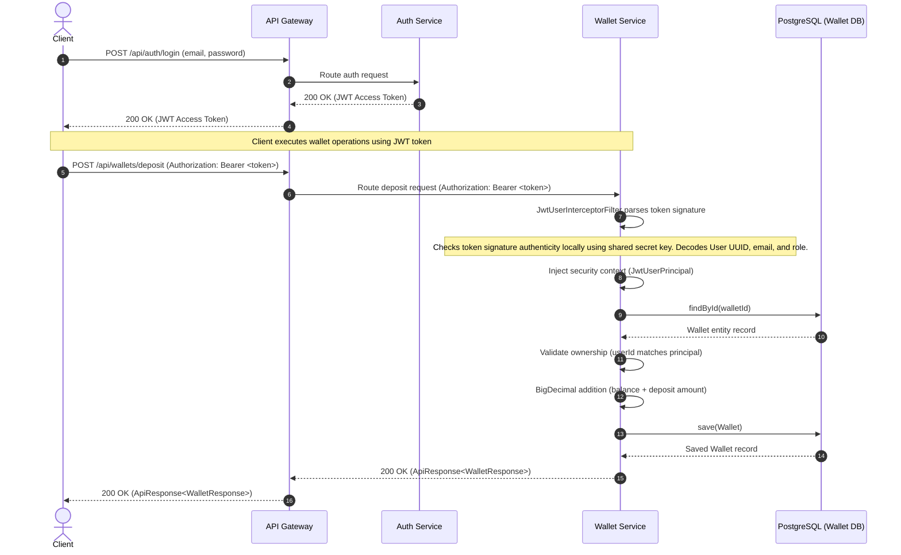
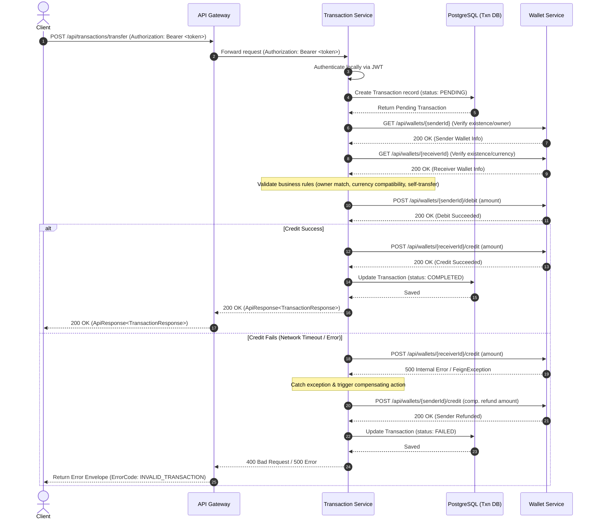
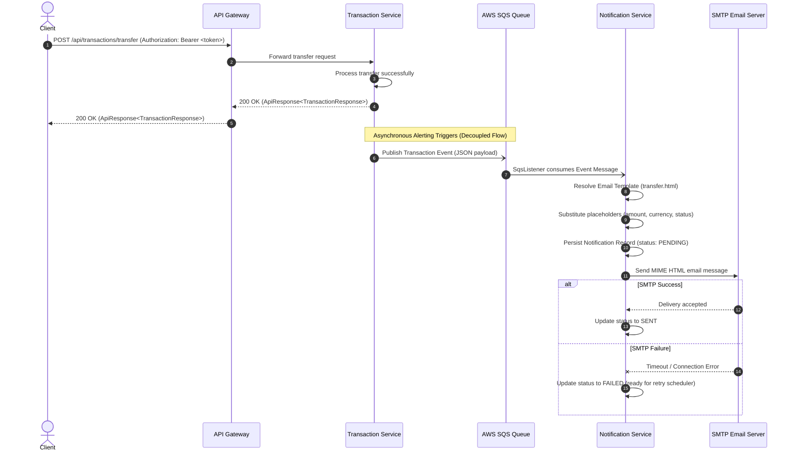
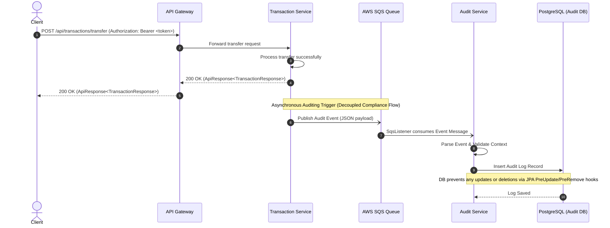
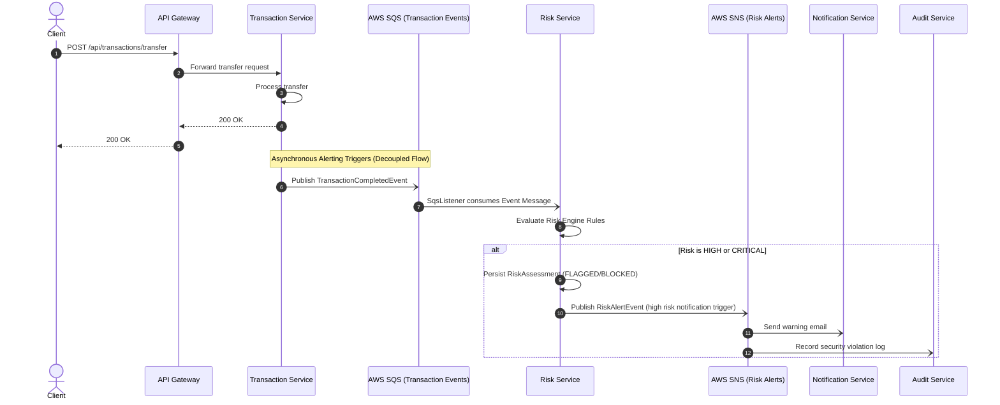
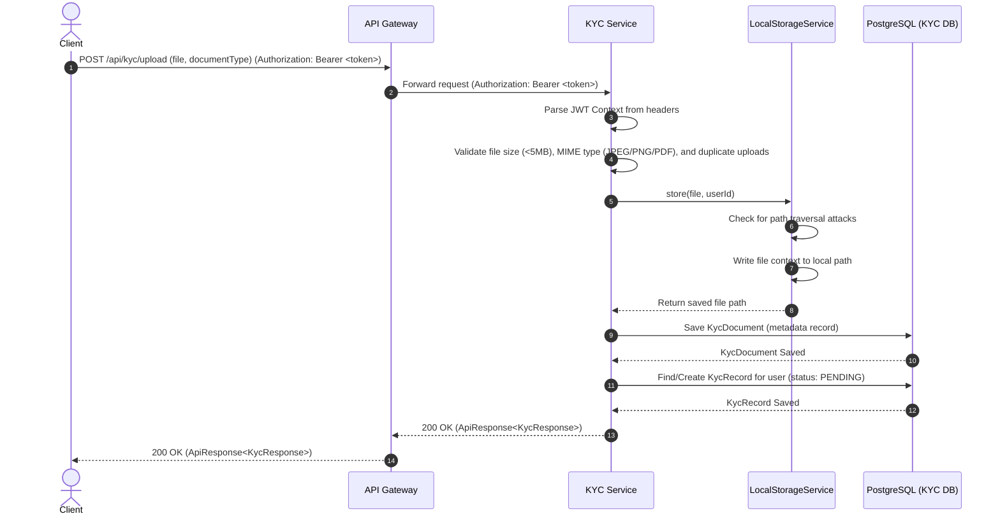
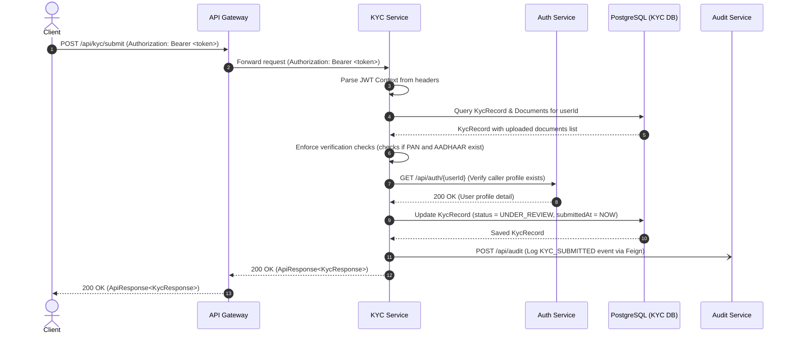
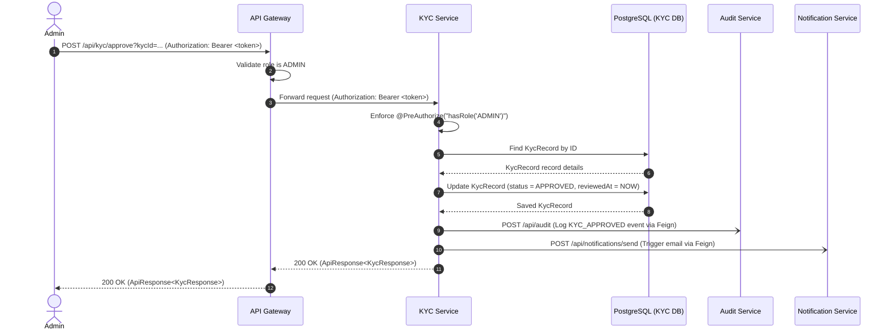
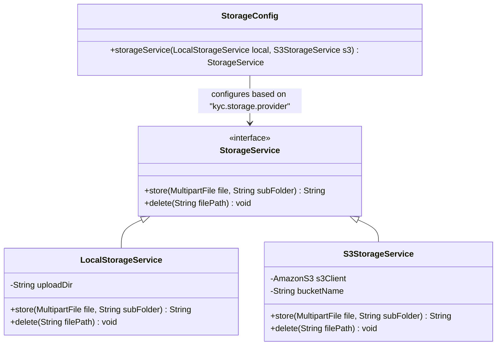
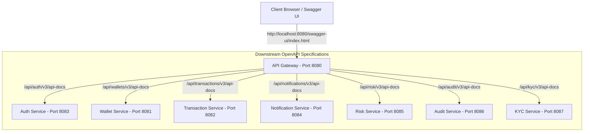

# CryptoVault System Architecture

This document details the high-level architecture of the **CryptoVault** digital asset wallet platform.

## 1. High-Level Architecture Overview

CryptoVault utilizes a decentralized microservices-based architecture to ensure separation of concerns, scalability, and isolated database contexts. All user client requests first terminate at a centralized **API Gateway**, which handles edge security checks, request logging, CORS, JWT verification, request headers decoration, and ingress traffic routing.

```
                               +--------------+
                               | Client Apps  |
                               +------┬-------+
                                      | HTTPS / HTTP
                                      ▼
                               +--------------+
                               | API Gateway  | (Single Ingress Endpoint)
                               | (Port 8080)  |
                               +------┬-------+
                                      | HTTP Forwarding (Internal Network)
      +--------------+----------------+--------------+--------------+--------------+--------------+
      |              |                |              |              |              |              |
      ▼              ▼                ▼              ▼              ▼              ▼              ▼
 +----------+  +----------+     +----------+   +----------+   +----------+   +----------+   +----------+
 |   Auth   |  |  Wallet  |     |  Trans.  |   |  Notif.  |   |  Audit   |   |   Risk   |   |   KYC    |
 | Service  |  | Service  |     | Service  |   | Service  |   | Service  |   | Service  |   | Service  |
 |(P: 8083) |  |(P: 8081) |     |(P: 8082) |   |(P: 8084) |   |(P: 8086) |   |(P: 8085) |   |(P: 8087) |
 +────┬─────+  +────┬─────+     +────┬─────+   +────┬─────+   +────┬─────+   +────┬─────+   +────┬─────+
      |             |                |              |              |              |              |
      ▼             ▼                ▼              ▼              ▼              ▼              ▼
 +----------+  +----------+     +----------+   +----------+   +----------+   +----------+   +----------+
 |PostgreSQL|  |PostgreSQL|     |PostgreSQL|   |PostgreSQL|   |PostgreSQL|   |PostgreSQL|   |PostgreSQL|
 |(Auth DB) |  |(WalletDB)|     |(Trans.DB)|   |(Notif.DB)|   |(Audit DB)|   | (Risk DB)|   | (KYC DB) |
 +----------+  +----------+     +----------+   +----------+   +----------+   +----------+   +----------+

                               Uses shared common-lib
```

---

## 2. Core Components and Responsibilities

### API Gateway (`api-gateway`)
- **Port:** `8080`
- **Role:** Centralized reverse proxy, security boundary guard, and API router.
- **Responsibilities:**
  - Routes external incoming paths (e.g. `/api/auth/**`, `/api/wallets/**`, `/api/transactions/**`) to corresponding backend services.
  - Validates incoming JWT token signatures cryptographically using a shared symmetric key.
  - Rejects unauthenticated/invalid requests immediately at the boundary with standardized HTTP 401 response envelopes.
  - Extracts identity claims (`userId`, `email`, `role`) and injects them as downstream headers (`X-USER-ID`, `X-USER-EMAIL`, `X-USER-ROLE`), establishing a trusted trust boundary.
  - Handles global Cross-Origin Resource Sharing (CORS) rules.
  - Provides structured latency and trace logging formatted for Grafana Loki scraping.

### Auth Service (`auth-service`)
- **Role:** Security provider and user identity context authority.
- **Port:** `8083`
- **Database:** Dedicated PostgreSQL database (stores user credentials, roles, and profiles).
- **Responsibilities:**
  - Authenticates users by matching request emails and BCrypt-encoded password records.
  - Registers users, validating email uniqueness and checking password strength profiles.
  - Generates HMAC-SHA256 signed stateless JWT tokens.

### Wallet Service (`wallet-service`)
- **Role:** Wallet ledger manager.
- **Port:** `8081`
- **Database:** Dedicated PostgreSQL database (stores wallet accounts and asset balances).
- **Responsibilities:**
  - Manages wallet profiles mapped to a user's UUID.
  - Handles deposits and withdrawals validating balance limits.
  - Decodes user identity context directly from trusted headers (`X-USER-ID`, `X-USER-EMAIL`, `X-USER-ROLE`) injected by the gateway.

### Transaction Service (`transaction-service`)
- **Role:** Transaction history, audit logging, and asset transfer coordinator.
- **Port:** `8082`
- **Database:** Dedicated PostgreSQL database (stores transaction history ledger entries).
- **Responsibilities:**
  - Manages the transactional lifecycle (transfer, deposit, withdrawal) and audit trails.
  - Validates source and target wallets by communicating with the **Wallet Service** via OpenFeign (`WalletClient`).
  - Decodes user identity context directly from trusted headers (`X-USER-ID`, `X-USER-EMAIL`, `X-USER-ROLE`) injected by the gateway.
  - Protects ACID consistency in a microservices network by implementing local compensating transactions (saga rollback) when multi-service state changes fail downstream.

### Notification Service (`notification-service`)
- **Role:** Centralized notification engine (email and in-app alerts).
- **Port:** `8084`
- **Database:** Dedicated PostgreSQL database (stores notification history logs and delivery audits).
- **Responsibilities:**
  - Sends emails using SMTP server integrations via `JavaMailSender`.
  - Resolves HTML templates locally using `SimpleTemplateEngine` to do high-performance string replacement on classpath resources.
  - Keeps persistent audit trails of all sent/failed system notifications for historical lookups.
  - Validates user contexts directly from API Gateway-propagated headers (`X-USER-ID`, `X-USER-EMAIL`, `X-USER-ROLE`).
  - Provides REST endpoints for triggering notifications and listing log history.
  - Anticipates future asynchronous decoupled messaging by laying out structural listener placeholders for AWS SQS queue consumer bindings.

### Common Library (`common-lib`)
- **Role:** Shared dependencies utility library.
- **Responsibilities:**
  - Provides a single source of truth for base structures (e.g., `ApiResponse`, `UserContextDto`, `JwtUserPrincipal`).
  - Holds system enums (`Role`, `CurrencyType`, `TransactionType`, `ErrorCode`, `TransactionStatus`, `AuditEventType`).
  - Distributes custom exceptions (e.g., `BusinessException`).

### Audit Service (`audit-service`)
- **Role:** Compliance ledger and immutable security/financial activity auditor.
- **Port:** `8086`
- **Database:** Dedicated PostgreSQL database (stores historical activity log records).
- **Responsibilities:**
  - Manages immutable compliance logs triggered by security, identity, wallet, or transfer transactions.
  - Implements STRICT persistence boundaries ensuring log entries cannot be modified or deleted once saved.
  - Implements custom telemetry (Micrometer counters) measuring log generation, queries, and failures.
  - Prepares messaging listener layouts for consuming AWS SQS queues asynchronously.

### Risk Service (`risk-service`)
- **Role:** Fraud prevention, transaction monitoring, and security risk assessor.
- **Port:** `8085`
- **Database:** Dedicated PostgreSQL database (stores risk assessments logs).
- **Responsibilities:**
  - Evaluates user and transaction risk profiles dynamically using a Strategy Pattern-based rule engine.
  - Generates numerical risk scores mapping to `LOW`, `MEDIUM`, `HIGH`, or `CRITICAL` risk levels and determines mitigation status (`APPROVED`, `FLAGGED`, `BLOCKED`).
  - Queries transaction history, wallet metadata, and audit logs using Feign clients.
  - Publishes telemetry counters to monitor critical security anomalies.
  - Prepares SQS listener mappings for future fully decoupled async validation streaming.

### KYC Service (`kyc-service`)
- **Role:** Identity verification, document validation, and compliance tracking.
- **Port:** `8087`
- **Database:** Dedicated PostgreSQL database (stores KYC records and document metadata).
- **Responsibilities:**
  - Manages identity verification lifecycle (PENDING -> UNDER_REVIEW -> APPROVED/REJECTED/EXPIRED).
  - Handles secure multi-format document uploads using the Strategy Pattern to decouple storage implementations (Local vs S3).
  - Enforces mandatory verification checks (requiring `PAN` and `AADHAAR` documents) prior to review submission.
  - Verifies user existence by querying `auth-service` via Feign client.
  - Dispatches success/failure audit logs to `audit-service` and notifications to `notification-service` via Feign.
  - Exposes Prometheus telemetry counters to monitor KYC submissions, approvals, rejections, and uploads.
  - Prepares SQS listener blueprints for consuming asynchronous verification events.

---

## 3. Request Flow Sequence Diagrams

### User Registration & Authentication
Refer to the registration flow inside the identity logs.

### Cross-Service Authentication & Wallet Operations

The diagram below details the stateless verification model where **Wallet Service** resolves the caller's identity locally from the cryptographic signature of the JWT token without making any external API calls:



### Microservice-Based Transfer Flow & Compensating Rollback

Below is the sequence flow for executing a transfer from one user to another. The Transaction Service manages the transaction lifecycle, calling the Wallet Service via Feign. If the credit operation fails (e.g., network failure or wallet blocked), a compensating credit (refund) is issued to the sender:



### Asynchronous Notification Processing (Decoupled Flow)

Below is the diagram showing the proposed decoupled event-driven architecture. The client request triggers a business operation in the Transaction Service, which commits records and immediately returns success. In the background, it publishes an event message to AWS SQS. The Notification Service consumes this message asynchronously, resolves templates, audits the transaction, and delivers the email alert:



### Asynchronous Compliance Auditing (Decoupled Flow)

Below is the diagram showing the proposed decoupled compliance auditing architecture. The client request triggers a business operation in the Transaction Service, which completes and immediately returns success. In the background, it publishes an audit event message to AWS SQS. The Audit Service consumes this message asynchronously and persists it into the immutable database store:



### Risk Evaluation & Rule Engine Execution Flow

Below is the diagram detailing the synchronous risk evaluation flow executing within a transaction context. The controller delegates the evaluation request to the `RiskService` rule engine, which evaluates the autowired list of strategies against transaction history, audit trails, and amount scopes:

```mermaid
graph TD
    A[EvaluateRiskRequest] --> B[RiskService]
    B --> C[Query Transaction History via Feign]
    B --> D[Query User Audit Logs via Feign]
    B --> E[Run RiskRule Strategies]
    
    subgraph Rule Engine (Strategy Pattern)
    E --> F1[HighAmountRule]
    E --> F2[FrequentTransferRule]
    E --> F3[FailedTransferRule]
    E --> F4[RapidWithdrawalRule]
    end
    
    F1 --> G[Aggregate Risk Score]
    F2 --> G
    F3 --> G
    F4 --> G
    
    G --> H{Score Mapping}
    H -->|0 - 25| I[LOW Risk -> APPROVED]
    H -->|26 - 50| J[MEDIUM Risk -> APPROVED]
    H -->|51 - 75| K[HIGH Risk -> FLAGGED]
    H -->|76 - 100| L[CRITICAL Risk -> BLOCKED]
    
    I --> M[Persist Assessment & Return]
    J --> M
    K --> M
    L --> M
```

### Future Asynchronous Risk Validation Flow

Below is the proposed decoupled, event-driven architecture where transaction events trigger risk assessments asynchronously via SQS message queues and publish risk alerts to SNS to trigger downline blocks and alerts:



### KYC Document Upload Flow

The diagram below details the process where a user uploads an identity document. The KYC Service validates size bounds, file extension, and stores the file using the local storage strategy:



### KYC Submission Flow

Below is the request flow for a user submitting their KYC record for review. The KYC Service verifies that both AADHAAR and PAN document profiles exist before allowing the submission:



### KYC Review & Approval Flow

Below is the sequence diagram illustrating an Admin reviewing and approving a KYC submission. Security validation is enforced at the Gateway and KYC service level to prevent unauthorized reviews:



### KYC Storage Strategy Pattern Architecture

The KYC Service decouples the physical storage destination from the business logic using the **Strategy Pattern**. The system defaults to local directory storage in development but can switch dynamically to AWS S3 storage at runtime:



---

## 4. OpenAPI / Swagger Documentation Architecture

CryptoVault aggregates API documentation at the API Gateway using SpringDoc OpenAPI. Below is the documentation aggregator flow:



### Architectural Key Points:
1. **Single Entry Swagger UI:** Clients access a unified portal running at the API Gateway (`8080`). They do not need to hit microservices ports directly.
2. **Dynamic Downstream Aggregation:** The Gateway reads the OpenAPI definitions from each downstream service's custom path (e.g. `/api/auth/v3/api-docs`). It exposes these in a dropdown select box in the Swagger UI.
3. **Public Route Bypasses:** Path patterns like `/v3/api-docs/**`, `/swagger-ui/**`, `/swagger-ui.html`, and `/api/*/v3/api-docs` bypass the API Gateway authentication filter, allowing documentation access to anyone while preserving security on standard api paths.