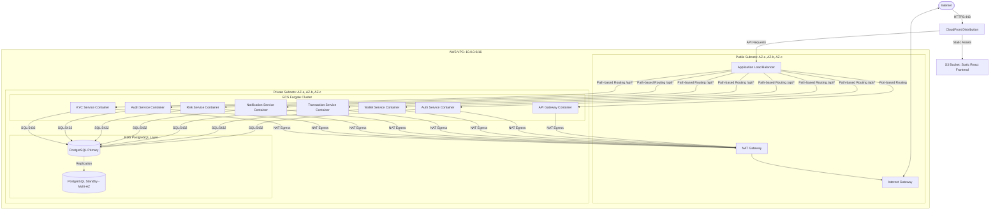

# AWS Cloud Architecture Specification — CryptoVault

This document details the target cloud architecture for migrating the CryptoVault platform to Amazon Web Services (AWS) using Terraform. The architecture is engineered to satisfy enterprise standards for security, high availability, fault tolerance, and scalable performance, aligning with Barclays' corporate infrastructure standards.

---

## 1. High-Level Architecture Diagram

Below is the conceptual architecture of the deployed system:

---

## 2. Network Design (VPC)

The network is partitioned to enforce security boundaries between public-facing and backend components.

### Subnet Layout and Allocation
* **VPC CIDR block**: `10.0.0.0/16`
* **Availability Zones**: Deployments span three AZs (`us-east-1a`, `us-east-1b`, `us-east-1c`) to prevent single-points-of-failure.
* **Public Subnets**:
  * `10.0.0.0/24` (AZ-a)
  * `10.0.1.0/24` (AZ-b)
  * `10.0.2.0/24` (AZ-c)
  * *Purpose*: Host the Application Load Balancer (ALB) and NAT Gateways.
* **Private Subnets**:
  * `10.0.10.0/24` (AZ-a)
  * `10.0.11.0/24` (AZ-b)
  * `10.0.12.0/24` (AZ-c)
  * *Purpose*: Host the ECS Fargate container instances and RDS PostgreSQL database subnet group.

### Route Tables
* **Public Route Table**: Routes all outbound traffic (`0.0.0.0/0`) through the VPC Internet Gateway (IGW).
* **Private Route Table**: Routes all outbound traffic (`0.0.0.0/0`) through a NAT Gateway located in the Public Subnets, ensuring that ECS containers can pull images or make external API calls but cannot be initiated from the public internet.

---

## 3. ECS Fargate Container Orchestration

Compute resources use **AWS ECS Fargate**, providing a serverless container environment that removes the operational overhead of scaling and patching underlying EC2 instances.

### Service Configurations
Containers are dynamically mapped and scheduled across availability zones using Fargate task definitions.

| Service Name | Port | Dev CPU/RAM | Prod CPU/RAM | Target Group Path |
| :--- | :---: | :---: | :---: | :--- |
| **api-gateway** | 8080 | 256 / 512 | 512 / 1024 | `/swagger-ui.html` |
| **auth-service** | 8083 | 256 / 512 | 512 / 1024 | `/api/auth/v3/api-docs` |
| **wallet-service** | 8081 | 256 / 512 | 512 / 1024 | `/api/wallets/v3/api-docs` |
| **transaction-service**| 8082 | 256 / 512 | 512 / 1024 | `/api/transactions/v3/api-docs` |
| **notification-service**| 8084 | 256 / 512 | 512 / 1024 | `/api/notifications/v3/api-docs` |
| **risk-service** | 8085 | 256 / 512 | 512 / 1024 | `/api/risk/v3/api-docs` |
| **audit-service** | 8086 | 256 / 512 | 512 / 1024 | `/api/audit/v3/api-docs` |
| **kyc-service** | 8087 | 256 / 512 | 512 / 1024 | `/api/kyc/v3/api-docs` |

### Service Autoscaling
In the `prod` environment, Autoscaling is configured for each microservice using **Target Tracking Scaling Policies**:
* **Metric**: `ECSServiceAverageCPUUtilization`
* **Target Value**: `70.0` (scales out when average CPU exceeds 70%)
* **Min/Max Capacity**: Min of `2` tasks (Multi-AZ) up to a max of `5` tasks per service.
* **Cooldowns**: Scale-in cooldown of 60 seconds; scale-out cooldown of 60 seconds.

---

## 4. Database Design (RDS PostgreSQL)

A fully managed **Amazon RDS for PostgreSQL** database acts as the persistence tier.

* **Version**: PostgreSQL `15.4`.
* **Storage**: Provisioned with `gp3` storage starting at 20 GB (Dev) or 100 GB (Prod), with autoscaling storage enabled up to a limit of 100 GB / 1000 GB.
* **Availability**:
  * **Dev**: Single-AZ deployment (`multi_az = false`) to minimize developer environment costs.
  * **Prod**: Multi-AZ deployment (`multi_az = true`) with a synchronous hot standby in a second AZ for automated failover.
* **Security Group Rules**: Strictly allows incoming connections on port `5432` only from the ECS Task Security Group. No external connections are permitted.

---

## 5. Security & Isolation Architecture

CryptoVault implements a multi-layered security model:

### Security Group Matrix
1. **ALB Security Group**: Allows port `80` (HTTP) and `443` (HTTPS) from the entire internet (`0.0.0.0/0` and `::/0`).
2. **ECS Tasks Security Group**: Allows ingress from the ALB Security Group only. Restricts egress to any destination via the NAT Gateway for external dependencies.
3. **Database Security Group**: Allows ingress on port `5432` from the ECS Tasks Security Group only.

### Identity & Access Management (IAM)
* **ECS Task Execution Role**: Assumed by the ECS agent to pull Docker images from AWS ECR, write system logs to CloudWatch Logs, and pull environment configurations.
* **ECS Task Role**: Assigned to the running containers, giving them specific application-level permissions (e.g. read/write from specific S3 buckets or dispatching emails via Amazon SES) following the principle of least privilege.
* **Secrets Protection**: DB credentials and application-level secrets are fetched from AWS Secrets Manager at task runtime using IAM policy attachments rather than being checked into code.

---

## 6. Frontend static site delivery (S3 + CloudFront)

The React single-page application (SPA) is hosted in an **Amazon S3** bucket and distributed globally via **Amazon CloudFront**.

* **S3 Security**: Block public access is fully enabled on the bucket. All static files are locked.
* **CloudFront Origin Access Control (OAC)**: Restricts direct access to the S3 bucket. Users must request files through the CloudFront endpoint.
* **SPA Routing Configuration**: Since React Router handles paths on the client side, requesting raw paths (like `/dashboard`) directly from S3 would return a `403` or `404` error. CloudFront is configured with custom error pages that catch `403` and `404` status codes, rewrite the response to a `200 OK`, and return `/index.html` to allow React Router to handle the route.
* **Caching**: Viewer protocol policy redirects all HTTP traffic to HTTPS. Caching behaviors optimize static delivery (CSS, JS, assets) with default TTL of 3600 seconds.
