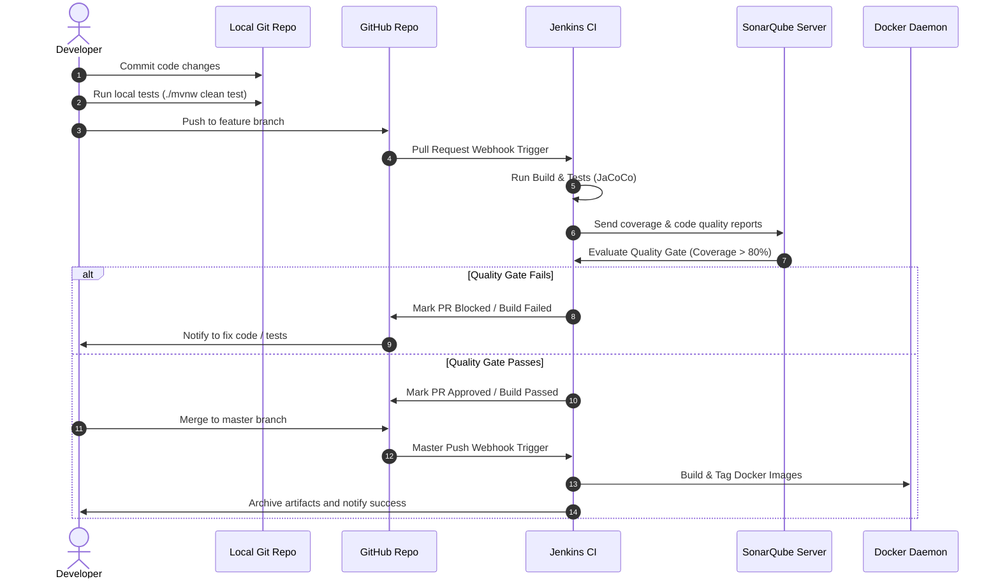

# DevOps Developer Workflow — CryptoVault

This document details the developer branching, quality validation, and delivery lifecycle for the CryptoVault application stack.

---

## 1. Developer Loop Workflow

---

## 2. Git Branching Strategy (GitFlow)

We follow a GitFlow-inspired branching strategy to ensure code quality:
1. **Feature Branches (`feature/*`)**: Developers write code and local unit tests here. Pushing to this branch triggers the Jenkins PR build (compilation, tests, and SonarQube scan).
2. **Develop Branch (`develop`)**: Integration branch where feature branches are merged. Actively built and deployed to the Dev/Staging environments.
3. **Master Branch (`master`)**: Production-ready code. Pushing/merging to `master` triggers the production Docker packaging and tags the images with the short commit hash and `latest`.

---

## 3. Quality Validation Gates

To ensure code meets standard security compliance before entering the artifact stage, the code passes through these gates:
* **Linter & Compiler**: The code must compile without errors.
* **JUnit Tests**: 100% of unit tests must pass.
* **JaCoCo Coverage**: Code coverage must meet the minimum target thresholds (Service Layer > 80%, Controller Layer > 70%, Security Layer > 80%).
* **SonarQube Static Analysis**: Detects blocker bugs, security vulnerabilities (OWASP Top 10), and code smells. The pipeline will immediately terminate if the quality gate status returns `ERROR`.

---

## 4. Artifact Generation & Progression

Once the build successfully passes all validation gates, the build artifacts progress:
1. **Frontend Assets**: Static React files are built inside the Node container, zipped, and archived directly on the Jenkins controller workspace for historical audit logs.
2. **Docker Containers**: Packaged on the host Docker engine and tagged immutable with `cryptovault-<service>:<commit_hash>` and `cryptovault-<service>:latest`.
3. **Log & Report Archives**: JUnit test reports (`surefire-reports`) and JaCoCo coverage reports are archived on Jenkins to provide long-term reporting dashboards.
