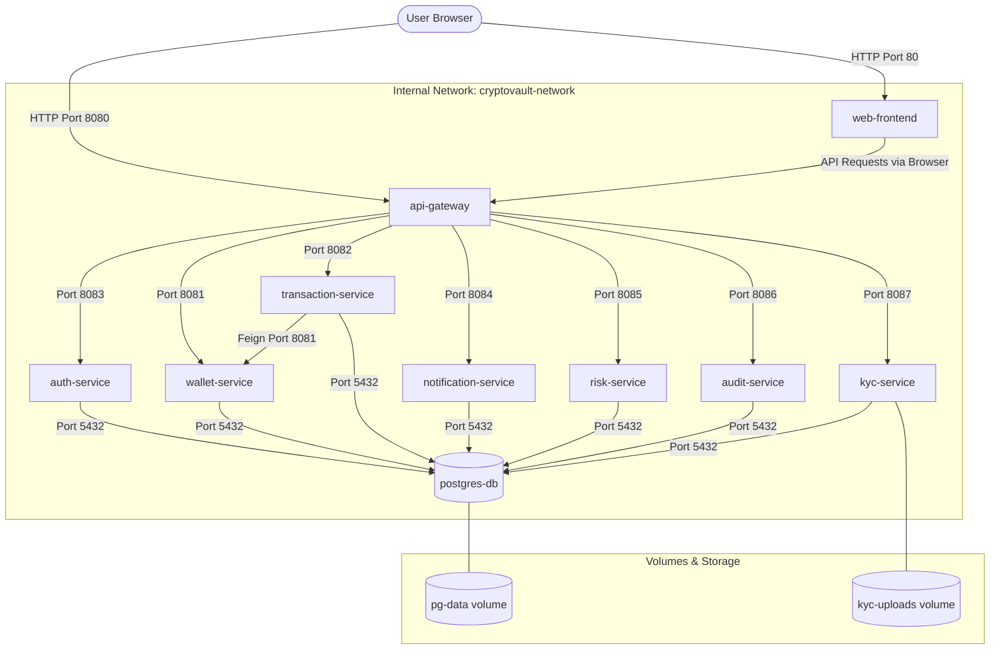

# CryptoVault Docker Architecture & Operation Guide

This document explains the containerization architecture of the CryptoVault platform, detailing the services, network orchestration, configuration management, and run commands.

---

## 1. Architectural Diagram

The diagram below visualizes the internal networking and communication structure inside the Docker virtual network.



---

## 2. Docker Services Reference

| Container Name | Role / Function | Internal Port | Host Port | Build Context |
| :--- | :--- | :--- | :--- | :--- |
| **postgres-db** | PostgreSQL Database storage | `5432` | `5432` | N/A (Official Image) |
| **auth-service** | Security authentication provider | `8083` | `8083` | `./backend` |
| **wallet-service** | Manages cryptocurrency wallets | `8081` | `8081` | `./backend` |
| **transaction-service** | Records transfers & handles Ledger | `8082` | `8082` | `./backend` |
| **notification-service** | Dispatch notifications (SMTP / Web) | `8084` | `8084` | `./backend` |
| **risk-service** | Anti-fraud scoring and validation | `8085` | `8085` | `./backend` |
| **audit-service** | Operations and compliance logging | `8086` | `8086` | `./backend` |
| **kyc-service** | Identity documents and approvals | `8087` | `8087` | `./backend` |
| **api-gateway** | Gateway router and OpenAPI aggregator | `8080` | `8080` | `./backend` |
| **web-frontend** | React Vite application running on Nginx | `80` | `80` | `./frontend/web-app` |

---

## 3. Network and Security Strategy

1. **Bridge Network (`cryptovault-network`)**: All containers are registered under a custom private bridge network. This guarantees automatic Docker DNS resolution using the service names (e.g. `http://auth-service:8083`) instead of IP addresses or localhost.
2. **Local Library Dependency (`common-lib`)**: The backend service builds use a shared context `./backend` which copies `common-lib` and installs it in the build container's local Maven repository (`~/.m2`) before compiling the microservices.
3. **Non-Root Execution**: Each JRE runtime container runs under a non-root Alpine user `appuser:appgroup` to prevent container-breakout vulnerabilities.
4. **Data Persistence**:
   - `pg-data`: Preserves database records outside container lifecycles.
   - `kyc-uploads`: Preserves submitted identity files from the KYC process.

---

## 4. Run Guide

### Prerequisite
Ensure Docker Desktop is installed and running on your host system.

### Running the Platform

1. **Build and Start All Services**:
   ```bash
   docker compose up --build -d
   ```
   *The `--build` flag compiles all Maven projects and npm packages inside the Docker build stages.*

2. **Check Container Statuses**:
   ```bash
   docker compose ps
   ```

3. **View Logging Output**:
   - Follow all logs:
     ```bash
     docker compose logs -f
     ```
   - Follow logs of a specific service:
     ```bash
     docker compose logs -f auth-service
     ```

4. **Shut down the Platform**:
   - Standard stop (retains volume data):
     ```bash
     docker compose down
     ```
   - Complete stop (erases volume data/database):
     ```bash
     docker compose down -v
     ```

---

## 5. Endpoints Verification

- **React Web App UI**: `http://localhost` (Served on Nginx host port 80)
- **API Gateway Swagger Hub**: `http://localhost:8080/swagger-ui.html` (Aggregates OpenAPI documentation for all 8 microservices)
