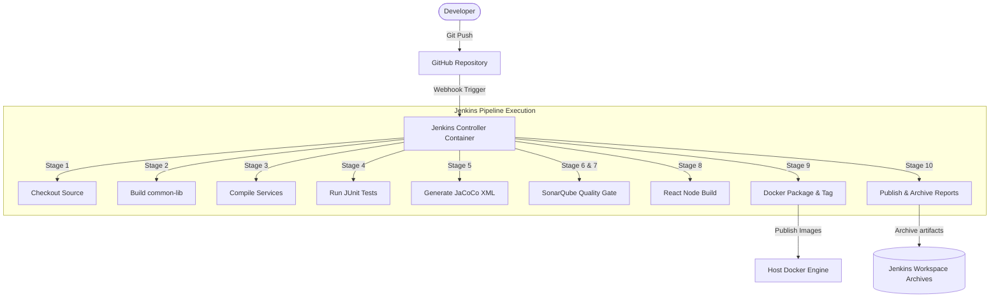

# Jenkins CI/CD Pipeline Architecture & Operation Guide

This document describes the enterprise-grade Jenkins CI/CD pipeline implemented for the CryptoVault microservices and React frontend platform.

---

## 1. CI/CD Architecture

The diagram below details the end-to-end continuous integration and deployment workflow.

---

## 2. Pipeline Stages & Build Strategy

We follow a strict dependency order to guarantee that our microservices compile cleanly:
1. **`common-lib`**: Build and installed in the local Maven cache first, as all microservices depend on its shared DTOs and security models.
2. **Microservices Compilation**: Built in topological order (`auth`, `wallet`, `transaction`, `notification`, `risk`, `audit`, `kyc`, and `api-gateway`).
3. **Frontend Compilation**: Uses a virtualized `node:20-alpine` Docker agent inside the pipeline. This avoids polluting the host Jenkins agent with Node/NPM dependencies and ensures consistent build environments.

---

## 3. SonarQube & Quality Gate Strategy

Our pipeline strictly integrates SonarQube checks:
- **Coverage Check**: Code coverage reports compiled by **JaCoCo** are piped directly to the SonarQube Scanner.
- **Enforcement Rules**: The pipeline pauses and queries SonarQube's API via `waitForQualityGate()`.
- **Pipeline Failure Conditions**:
  - Code Coverage drops below **`80%`**.
  - Any **Critical** or **Blocker** level vulnerability is detected by SonarQube.
  - Duplication exceeds **`3%`**.

---

## 4. Docker Integration & Image Tagging

We leverage Docker-outside-of-Docker (DooD) by mounting `/var/run/docker.sock` from the host to the Jenkins container. This permits the containerized Jenkins to interact directly with the host's Docker daemon.

### Tagging Policy
We tag images using two indicators for auditability and convenience:
1. **Git Commit Short Hash (e.g., `cryptovault-auth:a1b2c3d`)**: Uniquely identifies the exact source code commit that compiled this image. Used for immutable rollbacks.
2. **Latest Tag (e.g., `cryptovault-auth:latest`)**: Facilitates local development pulls and docker-compose orchestration updates.

---

## 5. Observability Configuration

Jenkins is configured to support future integration with **Prometheus** and **Grafana**:
- **Jenkins Prometheus Metrics Plugin**: Generates a scrapable endpoint at `http://localhost:8088/prometheus/`.
- Exposes critical metrics:
  - JVM Memory usage and garbage collection times.
  - Active and queued build counts.
  - Pipeline success and failure rates.
  - Agent executor availability.

---

## 6. Troubleshooting Guide

### Issue 1: Docker socket permission denied inside Jenkins container
- **Symptom**: `docker: command not found` or `Permission denied` when running Docker commands in Jenkins stages.
- **Solution**: Ensure `user: root` is specified in `docker-compose.yml` for the `jenkins` service. This grants Jenkins the required permissions to bind to the host's `/var/run/docker.sock`.

### Issue 2: SonarQube Scanner "Not authorized"
- **Symptom**: Maven scanner fails during static analysis with a 401 code.
- **Solution**: Generate a User Token in the SonarQube dashboard (`My Account` > `Security`). Store it as a Jenkins Secret Text credential named `sonarqube-token`.

---

## 7. Barclays Interview Talking Points (Enterprise Relevance)

1. **Docker-outside-of-Docker (DooD) over Docker-in-Docker (DinD)**:
   *"We mounted the host's `/var/run/docker.sock` directly into Jenkins rather than running a nested Docker daemon. DinD introduces container storage performance overhead and requires running the container in privileged mode, which violates Barclays' infrastructure security standards. DooD avoids this by letting Jenkins delegate all image packaging to the host's secure Docker daemon."*
2. **Immutable Build Environment**:
   *"Instead of installing Node.js directly on the Jenkins agent, we executed the frontend build stage inside a lightweight `node:20-alpine` Docker container dynamically spun up by the pipeline. This guarantees that different builds can run different Node/Java versions concurrently without tool conflicts."*
3. **Maven Wrapper (`mvnw`) usage**:
   *"We used the project's Maven wrapper `./mvnw` inside our stages instead of relying on a pre-installed Maven version in Jenkins. This ensures that compiler versions match the developer workspace exactly and eliminates 'builds working locally but failing on CI' issues."*
4. **Hard Fail Gates**:
   *"In banking, compliance is paramount. We configured the pipeline to hard-fail immediately if the SonarQube Quality Gate fails (e.g. coverage under 80% or any critical security vulnerability). This prevents non-compliant binaries from ever reaching our Docker registry."*
5. **Observability Readiness**:
   *"We prepared the pipeline for Prometheus scraping. This allows the centralized infrastructure team to monitor build health, queue wait times, and job failure rates in Grafana dashboards."*
