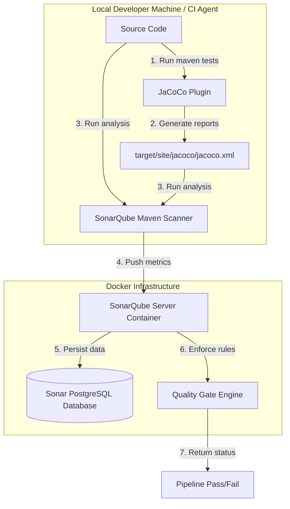

# SonarQube and JaCoCo Setup Guide — CryptoVault

This document outlines the architecture, containerized setup, custom Quality Gate metrics, test coverage configurations, and troubleshooting for the SonarQube and JaCoCo integration across the CryptoVault platform.

---

## 1. Architectural Architecture

The diagram below details the DevOps workflow for code quality scanning and test coverage reporting.



---

## 2. Infrastructure Setup & Configurations

We run SonarQube and a dedicated database service alongside our microservices in `docker-compose.yml`.

### Docker Services configuration

```yaml
  sonarqube-db:
    image: postgres:15-alpine
    container_name: sonarqube-db
    ports:
      - "5434:5432"
    environment:
      POSTGRES_DB: sonar
      POSTGRES_USER: sonar
      POSTGRES_PASSWORD: sonar_pass
    volumes:
      - sonar-db-data:/var/lib/postgresql/data
    healthcheck:
      test: ["CMD-SHELL", "pg_isready -U sonar -d sonar"]
      interval: 5s
      timeout: 5s
      retries: 5
    restart: always
    networks:
      - cryptovault-network

  sonarqube:
    image: sonarqube:10.3-community
    container_name: sonarqube
    ports:
      - "9000:9000"
    environment:
      - SONAR_JDBC_USERNAME=sonar
      - SONAR_JDBC_PASSWORD=sonar_pass
      - SONAR_JDBC_URL=jdbc:postgresql://sonarqube-db:5432/sonar
    depends_on:
      sonarqube-db:
        condition: service_healthy
    ulimits:
      nofile:
        soft: 65536
        hard: 65536
    restart: always
    networks:
      - cryptovault-network
```

### Critical Troubleshooting: Virtual Memory (`vm.max_map_count`)
SonarQube uses an embedded Elasticsearch instance which requires high virtual memory allocations on the host kernel.
If you see the container exit immediately with an error, run the following command on your host terminal (or inside WSL2):
```bash
sudo sysctl -w vm.max_map_count=262144
```

---

## 3. Metrics & Quality Gates

We enforce specific metrics and thresholds on our Quality Gate to block deployments that do not meet Barclays' standard governance requirements:

### Quality Gate Thresholds
* **Bugs**: `0` (Critical/Blocker level bugs must fail the build)
* **Vulnerabilities**: `0` (Any vulnerability of high/medium severity fails the build)
* **Code Smells**: Maintainability Rating must be `A`
* **Duplicated Lines**: `< 3.0%` (Ensures modularity and DRY principles)

### Test Coverage Goals
To ensure robust testing of critical application parts, we establish layer-based coverage gates:

| Application Layer | package Name Patterns | Target Coverage Threshold |
| :--- | :--- | :--- |
| **Service Layer** | `com.cryptovault.*.service.*` | **> 80%** |
| **Controller Layer** | `com.cryptovault.*.controller.*` | **> 70%** |
| **Security Layer** | `com.cryptovault.*.security.*` | **> 80%** |

---

## 4. Coverage Strategy & JaCoCo Exclusions

Some code layers (like database entities, DTOs, exception handlers, and configuration files) do not contain business logic and should be excluded from SonarQube's coverage metric calculation. Excluding them ensures that our coverage metrics reflect actual test quality.

### Exclusion Patterns
We configure these exclusions in our `sonar-project.properties` or Maven properties:
* **Entities & DTOs**: `**/entity/**`, `**/dto/**`, `**/model/**`
* **Exceptions**: `**/exception/**`
* **Configuration Files**: `**/config/**`, `**/*Config.java`, `**/*Application.java`
* **Autogenerated Code**: Lombok-generated files (already excluded by lombok config: `lombok.addLombokGeneratedAnnotation = true` in `lombok.config`)

### Sample exclusion Configuration in Maven `pom.xml`:
```xml
<properties>
    <!-- Exclude from SonarQube analysis -->
    <sonar.exclusions>
        src/main/java/com/cryptovault/*/entity/**,
        src/main/java/com/cryptovault/*/dto/**,
        src/main/java/com/cryptovault/*/config/**,
        src/main/java/com/cryptovault/*/exception/**
    </sonar.exclusions>
</properties>
```

---

## 5. Execution & Analysis Commands

### Step 1: Run Tests and Generate Reports
Execute tests inside any microservice folder. This will automatically trigger `jacoco-maven-plugin` to output coverage statistics:
```bash
mvn clean test
```
*This produces the file `target/site/jacoco/jacoco.xml`.*

### Step 2: Push Metrics to SonarQube
Push the code and JaCoCo coverage reports to the SonarQube server running on port 9000:
```bash
mvn sonar:sonar \
  -Dsonar.host.url=http://localhost:9000 \
  -Dsonar.token=your_generated_sonarqube_token
```

### Step 3: Scan React Frontend
Navigate to `frontend/web-app/` and run the Sonar Scanner:
```bash
sonar-scanner \
  -Dsonar.host.url=http://localhost:9000 \
  -Dsonar.token=your_generated_sonarqube_token
```

---

## 6. Interview Talking Points (Barclays DevOps Context)

If asked about this setup during interviews, highlight these structural and engineering decisions:

1. **Isolation of Datastores**: 
   *"We didn't share the main database container with SonarQube. We spun up a dedicated `sonarqube-db` PostgreSQL service on port `5434`. This ensures database backup scripts, transactional schemas, and security patches for our application do not get cluttered with static analysis indexes."*
2. **Container Security Compliance**: 
   *"All our microservice JRE containers run as a non-root `appuser`. SonarQube itself is run as user `sonarqube` inside the official image. We respect standard Unix permissions and avoid giving Docker containers root access to the host file system."*
3. **Double-Compatible Configuration**: 
   *"We designed the database connection configurations in `application.properties` to support environment placeholders with fallback defaults (`${DB_HOST:localhost}`). This allows engineers to run tests and push to SonarQube locally on `localhost` without needing Docker running, but automatically switches to container-aware network names in the CI/CD pipeline."*
4. **Elasticsearch Bootup Caveat**: 
   *"When containerizing SonarQube, Elasticsearch requires a change to host virtual memory bounds (`vm.max_map_count`). We added this to our troubleshooting guidelines to make onboarding smooth for other developers."*
5. **Quality Gate Integration in CI/CD**: 
   *"We configured JaCoCo to output reports in XML format. During our pipeline, if SonarQube returns a Quality Gate failure (e.g., Service Layer coverage drops below 80%), the pipeline runner fails the build immediately, stopping unsafe code from merging to master."*
